## I'm using pnpm for a more efficient and clear package.json

Used in my testing website [Electric Circuits](http://diogny.com/tests/circuits.php).

### Issues
	have to use "@types/node": "12.12.21" because of a compatibility bug with Typescript

### Functionality and Wiring

	Press F1 or Ctrl+H for Help
	
	Right-click shows context menu for individual board items
	Board panning: Shift + Left-Click drag
	Board ViewBox reset/center using tool button click
	Board Zoom click on zoom buttoms, later scroll will do it

	Start new Wire: Ctrl + Left-Click over EC node
	Highlighted wire nodes and Wire lines can be dragged and aligned
	Escape stops wiring
	Bond lose wire end: Ctrl + Left-Click on highlighted wire node, drag and drop over EC node or Wire node
	EC and Wire tooltip label should be deleted in the future, only EC node labels should stay
	
	Ctrl + Left-Click on Board and drag shows selection rectangle for ECs
	Left-Click on EC body hold and drag, multiple selected are dragged too
		if Shift is pressed at the begining then all connected ECs and wires are dragged too
	Ctrl + Left-Click on EC select/unselect
	Left-Click on EC body shows it's properties
	

### Last compilation:
	We are using Node.js 12.14.1, Chromium 83.0.4103.119, and Electron 9.0.5.

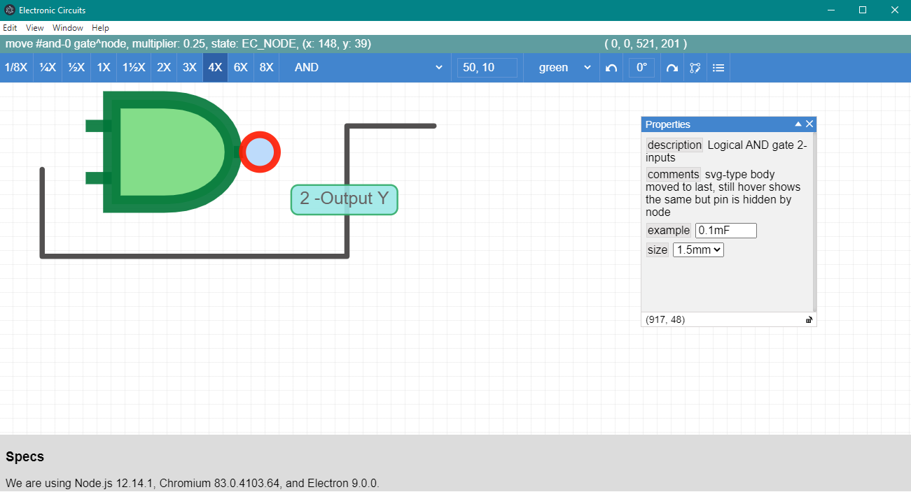

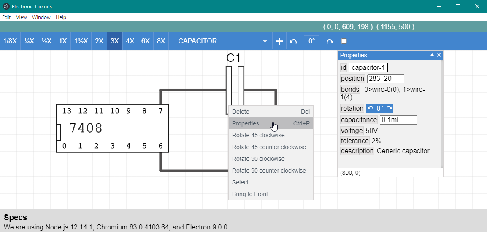

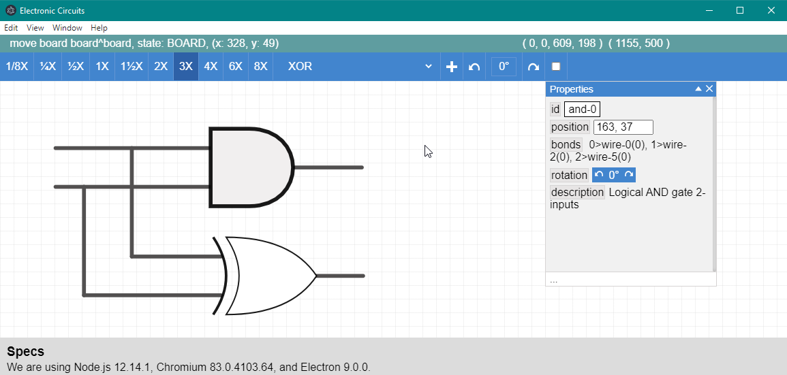

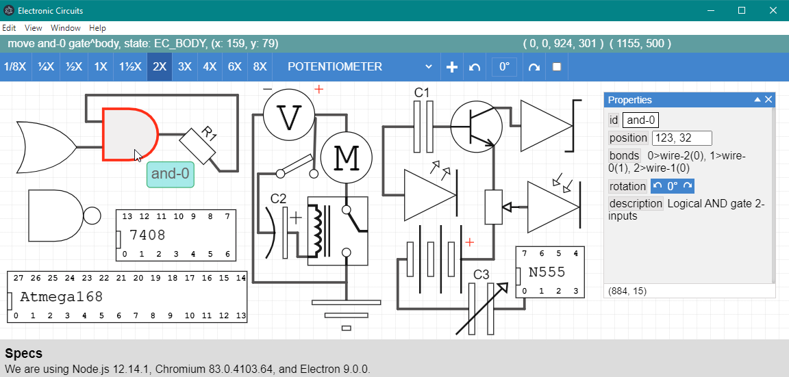

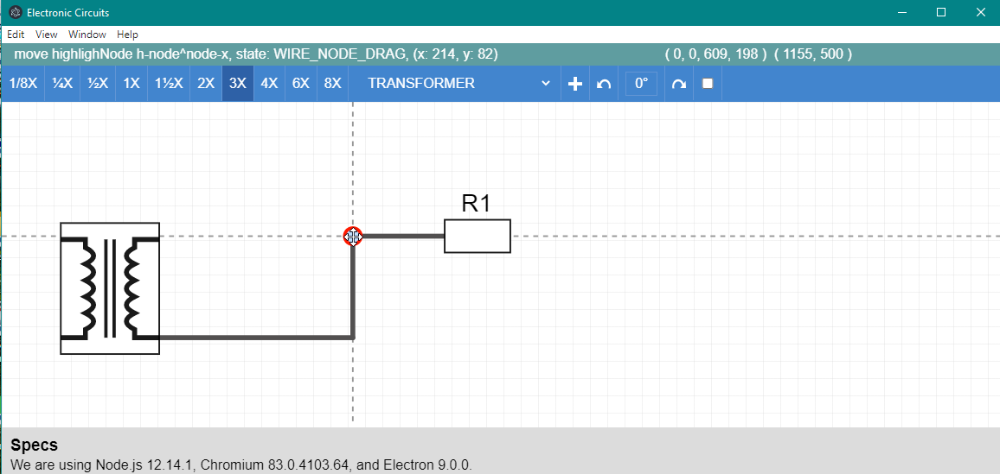

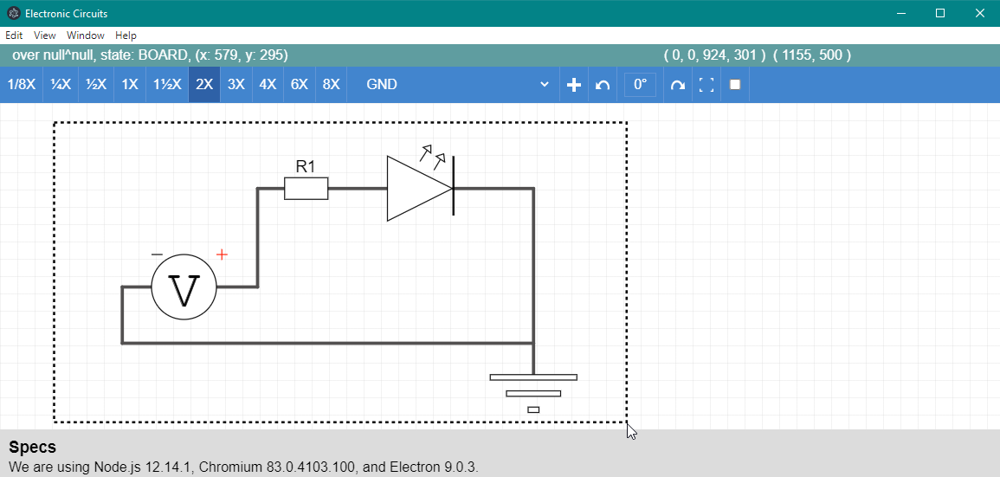

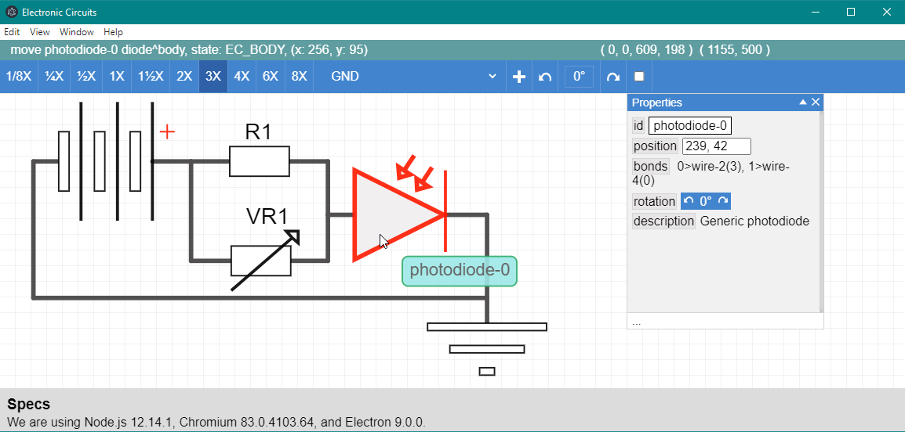

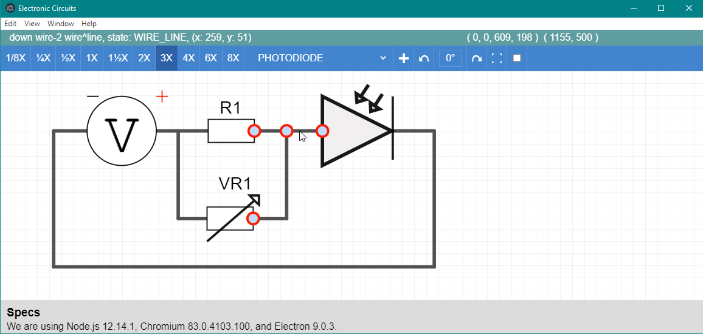

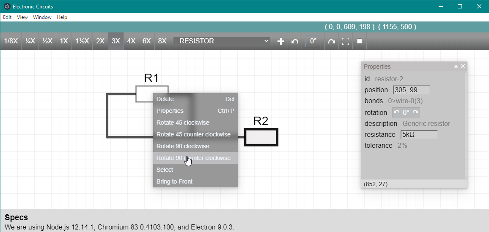

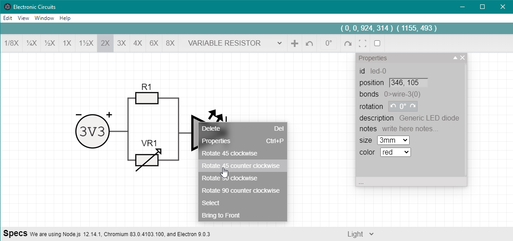

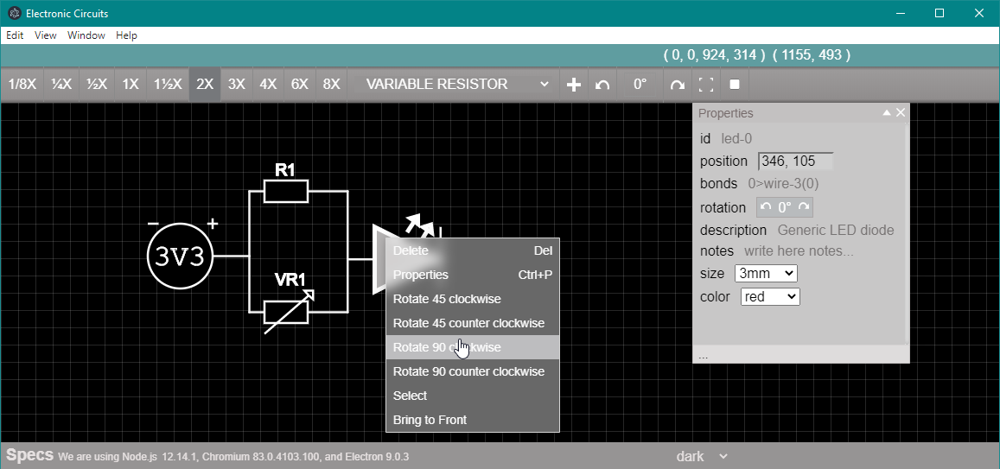

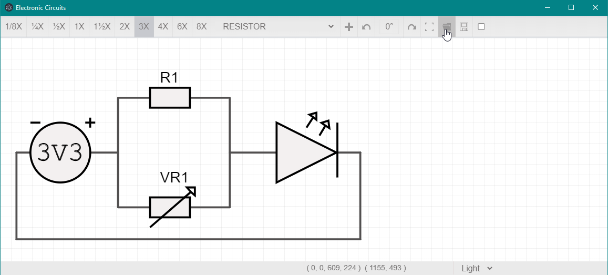

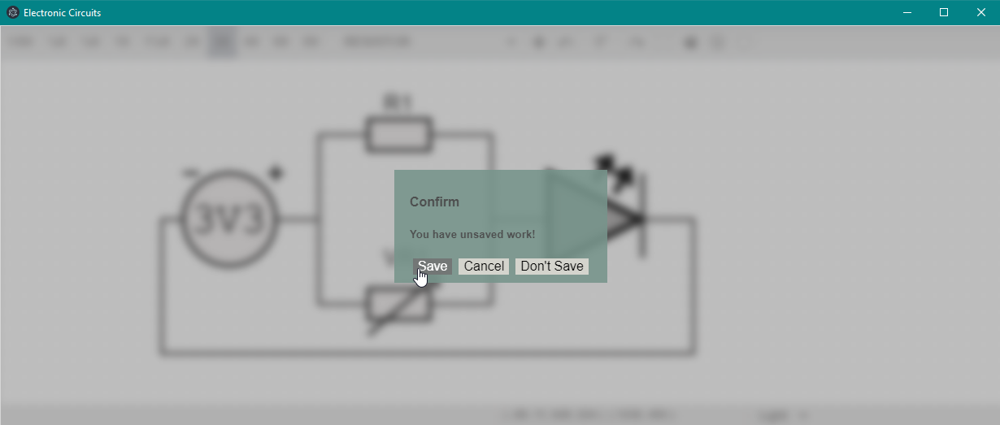

