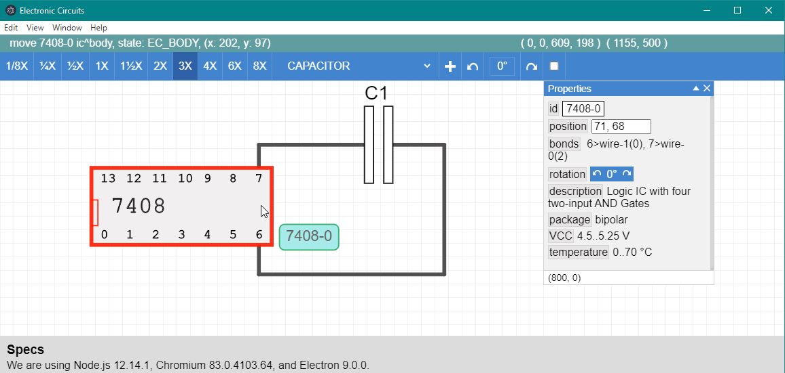

## I'm using pnpm for a more efficient and clear package.json

Used in my testing website [Electric Circuits](http://diogny.com/tests/circuits.php).

### Issues
	have to use "@types/node": "12.12.21" because of a compatibility bug with Typescript

### Functionality and Wiring
	Right-click shows context menu
	Start new Wire: Ctrl + Left-Click over EC node
	Escape stops wiring
	Bond lose wire: Ctrl + Left-Click, drag and drop over EC node or Wire node
	Highlighted wire nodes can be dragged and aligned
	Board panning: Alt+click drag
	Ctrl + Left-Click and drag on board select ECs
	Ctrl + Left-Click on EC select/unselect

### Last compilation:
	We are using Node.js 12.14.1, Chromium 83.0.4103.100, and Electron 9.0.3.

### install development packajes
	pnpm install --save-dev tsconfig-paths-webpack-plugin
	pnpm install electron-reload --save-dev

### testings
	pnpm i mocha -D
	pnpm i chai -D
	
### build/run
	pnpm run build-dev		builds all
	pnpm run start			builds all & starts electron app
	pnpm run app			starts electron app

### git
	git init
		Initialized empty Git repository in C:/Users/diogn/OneDrive/Projects/npm/electric-circuits/.git/

### git add files
	git add .
	git add package.json
	git add tsconfig.json
	git add dist/
	git add test/
	git add readme.md
	git add .gitignore
	

### git first commit
	git commit -m "first commit"
	git remote add origin https://github.com/Diogny/electric-circuits.git
	git push -u origin master

### git update
	git status
	git rm --cached dist/src/boardCircle.js
	git add <file> ...	git add .
	git add -u					stage the modified and deleted files
	git add -A
	git commit -m "update message"
	git tag v1.1.3
	git push origin master --tags

